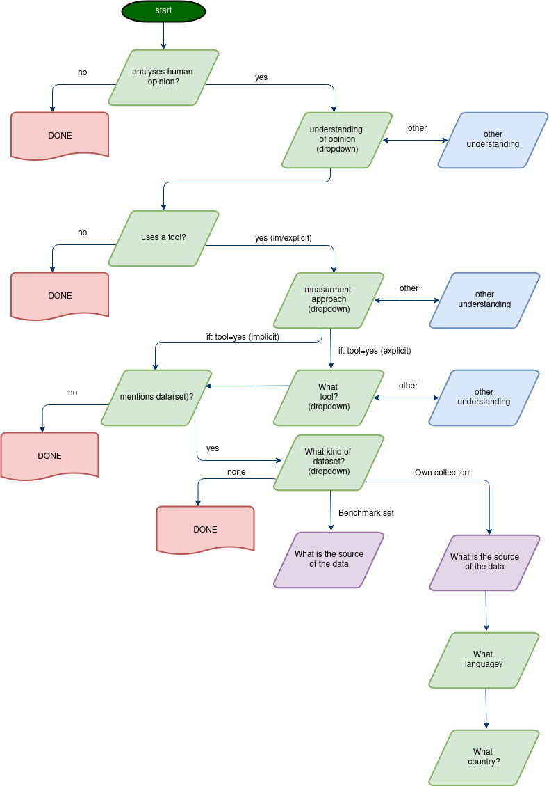

# opinion-wg2

Some file for the OPINION working group 2 abstract annotation task.

- **pilot** contains the results from the annotation pilot
- **icr-1** contains the codebook setup and slides with results of the first round of annotations (meant to establish intercoder-reliability)
- **icr-2** contains the draft codebook setup for the second round
- codebook-flowchart.drawio can be edited with <https://app.diagrams.net/> (formerly draw.io) and shows the branching of the codebook

